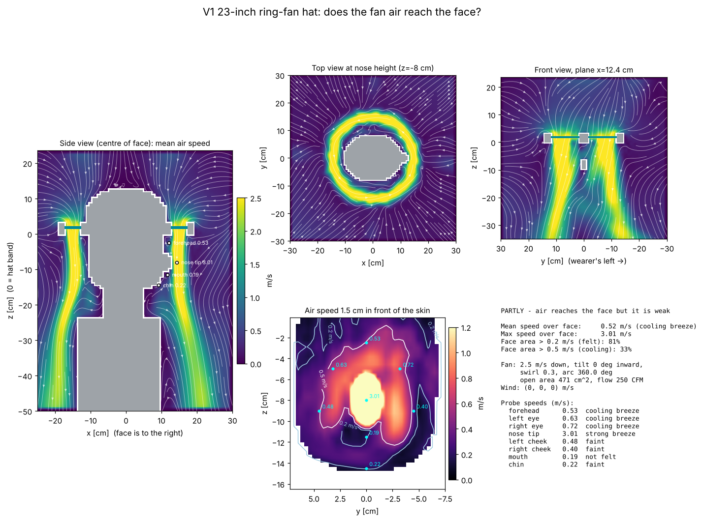

# hatflow: airflow simulator for the ring-fan hat

A small 3D CFD tool that answers one question: **does the air from the fan
ring in the brim actually reach the wearer's face?**

It models a 23-inch head, neck and shoulders, the hat crown and brim, and
the rotating blade ring as a fan disc that pushes air. It then computes the
air movement around the wearer and reports the air speed just in front of
the skin: forehead, eyes, nose, cheeks, mouth and chin, plus a map over the
whole face.



## Quick start

```bash
cd hat-fan-sim
pip install -r requirements.txt

python -m hatflow geometry -c configs/v1_23in.json          # check the 3D model first (no simulation)
python -m hatflow run -c configs/v1_23in.json --quick       # ~30 s, 12 mm cells
python -m hatflow run -c configs/v1_23in.json --vtk         # ~3-5 min, 8 mm cells, plus a ParaView file
```

Results go to `results/<name>/`:

| file | what it is |
|---|---|
| `summary.png` | side, top and front flow slices, a face air-speed map, and the verdict |
| `report.md` | the headline numbers and a table of probe speeds |
| `results.json` | every number, plus the config used |
| `flow.vtk` | the full 3D velocity field for ParaView (with `--vtk`) |

## Trying design changes

You can change any setting from the command line with `--set`, or copy
`configs/v1_23in.json` and edit it.

```bash
# louvers that angle the air 20 degrees inward toward the face
python -m hatflow run -c configs/v1_23in.json --set fan.tilt_inward_deg=20

# a weaker motor
python -m hatflow run -c configs/v1_23in.json --set fan.exit_speed=1.5

# blow only from the front 120 degrees of the ring
python -m hatflow run -c configs/v1_23in.json --set fan.active_arc_deg=120

# compare several values side by side (writes sweep.png and sweep.csv)
python -m hatflow sweep -c configs/v1_23in.json --quick --param fan.tilt_inward_deg --values 0 10 20 30
python -m hatflow sweep -c configs/v1_23in.json --quick --param env.wind --values "[0,0,0]" "[-1.3,0,0]"
```

Key settings (full list in [`hatflow/config.py`](hatflow/config.py)):

| setting | meaning |
|---|---|
| `fan.exit_speed` | mean air speed through the blade ring, m/s. **Measure this on your bench prototype with an anemometer.** It drives every result. |
| `fan.inner_radius`, `fan.outer_radius` | where the blade ring sits, measured from the hat's centre |
| `fan.tilt_inward_deg` | how far the exit louvers or blades angle the air toward the head |
| `fan.swirl_ratio` | sideways (tangential) speed the spinning ring adds, divided by the downward speed |
| `fan.direction` | `down` blows onto the wearer; `up` pulls air up and out of the brim |
| `fan.active_arc_deg` | 360 = full ring; smaller = only a front sector blows |
| `env.wind` | air moving past the wearer, m/s. Walking forward at 1.3 m/s is `[-1.3, 0, 0]` |
| `head.circumference` | head girth in metres (0.584 = 23 in) |
| `domain.dx` | cell size. 0.012 is quick, 0.008 is the default, 0.005 is fine detail but slow |

Coordinates: +x is the direction the wearer faces, +y is the wearer's left,
+z is up, and z = 0 is the underside of the brim.

## Using your real CAD (STL)

The built-in head and hat are simple shapes sized to your V1 drawings. To
use the real parts instead, export **watertight** STLs, aligned to the
coordinate frame above:

```json
"head": {"stl": "cad/mannequin_head.stl", "stl_scale": 0.001, "stl_offset": [0, 0, -0.02]},
"hat":  {"stl": "cad/hat_assembly.stl",   "stl_scale": 0.001}
```

`stl_scale` converts from your STL units to metres, so 0.001 means the STL
is in millimetres. The fan ring is still defined by the `fan.*` radii and is
cut out of the hat STL, so set them to match your blade ring. Run
`python -m hatflow geometry` first and check that everything lines up.
Don't include the grille wires; they are far thinner than one cell.

## Reading the results

The face is graded on the average air speed 1.5 cm in front of the skin:

| speed at the face | how it feels |
|---|---|
| < 0.2 m/s | not felt; this is about normal still-room air movement |
| 0.2–0.5 m/s | a faint draught |
| 0.5–1.0 m/s | a noticeable cooling breeze |
| > 1.0 m/s | a strong breeze |

These thresholds come from thermal-comfort practice; ASHRAE 55 treats
0.2 m/s as the point where air movement starts to matter. You can change
them under `face.*`.

## How it works, and its limits

- **Solver:** lattice-Boltzmann (D3Q19) with a Smagorinsky large-eddy
  turbulence model. The core loop is a fused numba kernel generated by
  `tools/gen_kernel.py`, and runs at about 10–15 million cell updates per
  second on 4 CPU cores.
- **Fan:** a thin layer inside the brim where the air velocity is set to
  the fan exit velocity, including tilt and swirl. Blade geometry, the motor
  and the grille are not modelled. You supply the exit speed and the
  simulator works out where that air goes.
- **Walls** are made of cubic cells ("stair-stepped"). At 8 mm cells the
  nose is only a few cells across, so treat individual probe values as
  ±0.1–0.2 m/s.
- **Viscosity:** for numerical stability the simulated air is about 30–50×
  more viscous than real air, plus the turbulence model on top. Real
  turbulent jets mix a bit faster and wobble more, so the solver gives an
  averaged, smoothed picture.
- **Use it to compare designs.** Rankings such as "20° tilt reaches the
  mouth and 0° doesn't" are reliable. Absolute speeds should be checked
  against a few anemometer readings at the face of the bench prototype.
- Results are averaged over the second half of the simulated time,
  after the flow has settled.

## Files

```
hatflow/config.py     all settings and defaults
hatflow/geometry.py   voxel head, torso, hat, fan ring (or your STLs)
hatflow/lbm.py        solver driver, boundary conditions, units
hatflow/_kernel.py    generated LBM kernel (do not edit; see tools/gen_kernel.py)
hatflow/analysis.py   face probes, face map, verdict
hatflow/plots.py      figures
hatflow/export.py     JSON / Markdown / VTK output
configs/v1_23in.json  V1 bench prototype
examples/             pre-computed results
```
