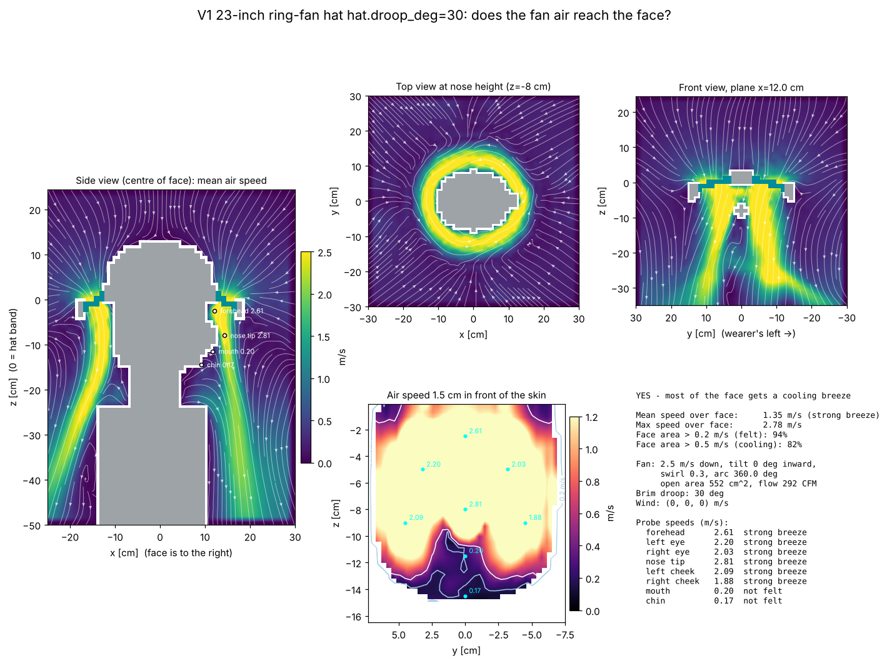

# V1 23-inch ring-fan hat hat.droop_deg=30: airflow to the face

**YES - most of the face gets a cooling breeze**

| metric | value |
|---|---|
| mean air speed over face | 1.35 m/s (strong breeze) |
| max air speed over face | 2.78 m/s |
| face area feeling > 0.2 m/s | 94% |
| face area cooled > 0.5 m/s | 82% |
| fan exit speed / open area | 2.5 m/s / 552 cm² |
| fan volume flow | 138 L/s (292 CFM) |

## Probes

| point | mean speed m/s | turbulence rms m/s | feel |
|---|---|---|---|
| forehead | 2.61 | 0.01 | strong breeze |
| left eye | 2.20 | 0.01 | strong breeze |
| right eye | 2.03 | 0.01 | strong breeze |
| nose tip | 2.81 | 0.01 | strong breeze |
| left cheek | 2.09 | 0.01 | strong breeze |
| right cheek | 1.88 | 0.01 | strong breeze |
| mouth | 0.20 | 0.01 | not felt |
| chin | 0.17 | 0.01 | not felt |

## Solver

163,863 cells at 12 mm, 2176 steps (0.8 s simulated, averaged over the last 0.40 s), runtime 7 s.
