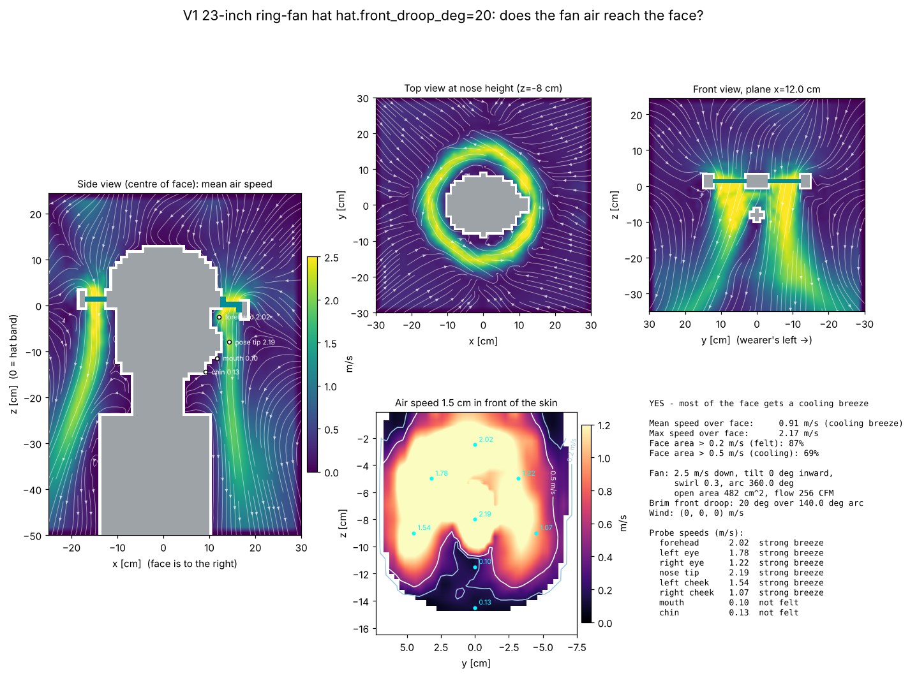

# V1 23-inch ring-fan hat hat.front_droop_deg=20: airflow to the face

**YES - most of the face gets a cooling breeze**

| metric | value |
|---|---|
| mean air speed over face | 0.91 m/s (cooling breeze) |
| max air speed over face | 2.17 m/s |
| face area feeling > 0.2 m/s | 87% |
| face area cooled > 0.5 m/s | 69% |
| fan exit speed / open area | 2.5 m/s / 482 cm² |
| fan volume flow | 121 L/s (256 CFM) |

## Probes

| point | mean speed m/s | turbulence rms m/s | feel |
|---|---|---|---|
| forehead | 2.02 | 0.01 | strong breeze |
| left eye | 1.78 | 0.01 | strong breeze |
| right eye | 1.22 | 0.01 | strong breeze |
| nose tip | 2.19 | 0.02 | strong breeze |
| left cheek | 1.54 | 0.01 | strong breeze |
| right cheek | 1.07 | 0.01 | strong breeze |
| mouth | 0.10 | 0.01 | not felt |
| chin | 0.13 | 0.02 | not felt |

## Solver

163,863 cells at 12 mm, 2176 steps (0.8 s simulated, averaged over the last 0.40 s), runtime 25 s.
