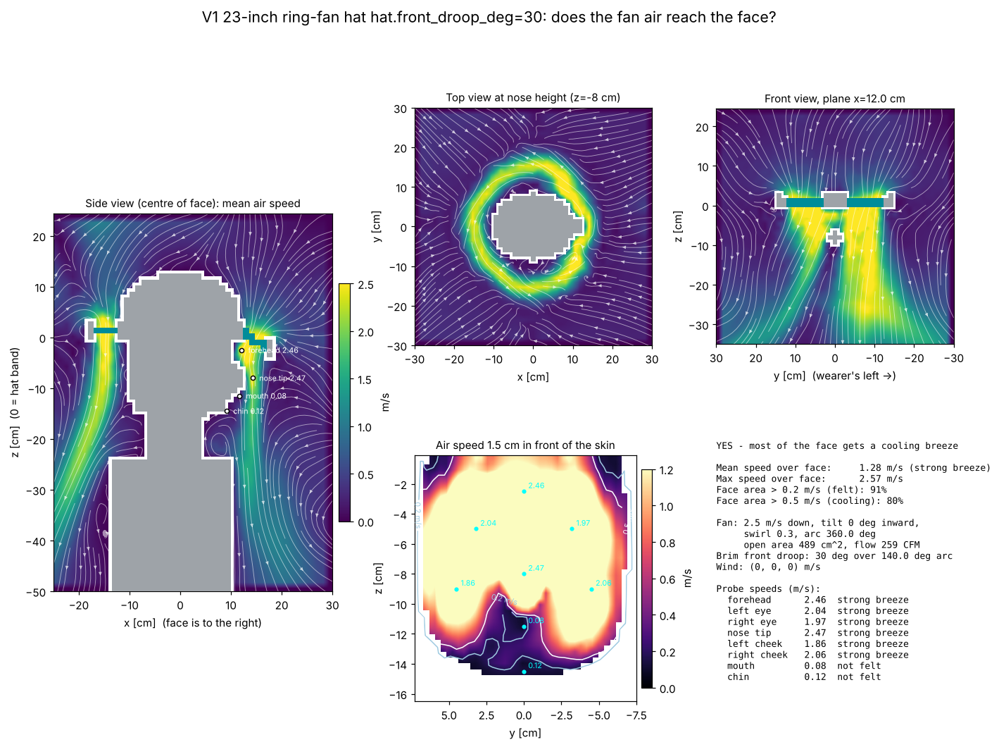

# V1 23-inch ring-fan hat hat.front_droop_deg=30: airflow to the face

**YES - most of the face gets a cooling breeze**

| metric | value |
|---|---|
| mean air speed over face | 1.28 m/s (strong breeze) |
| max air speed over face | 2.57 m/s |
| face area feeling > 0.2 m/s | 91% |
| face area cooled > 0.5 m/s | 80% |
| fan exit speed / open area | 2.5 m/s / 489 cm² |
| fan volume flow | 122 L/s (259 CFM) |

## Probes

| point | mean speed m/s | turbulence rms m/s | feel |
|---|---|---|---|
| forehead | 2.46 | 0.01 | strong breeze |
| left eye | 2.04 | 0.01 | strong breeze |
| right eye | 1.97 | 0.01 | strong breeze |
| nose tip | 2.47 | 0.01 | strong breeze |
| left cheek | 1.86 | 0.01 | strong breeze |
| right cheek | 2.06 | 0.01 | strong breeze |
| mouth | 0.08 | 0.01 | not felt |
| chin | 0.12 | 0.01 | not felt |

## Solver

163,863 cells at 12 mm, 2176 steps (0.8 s simulated, averaged over the last 0.40 s), runtime 26 s.
