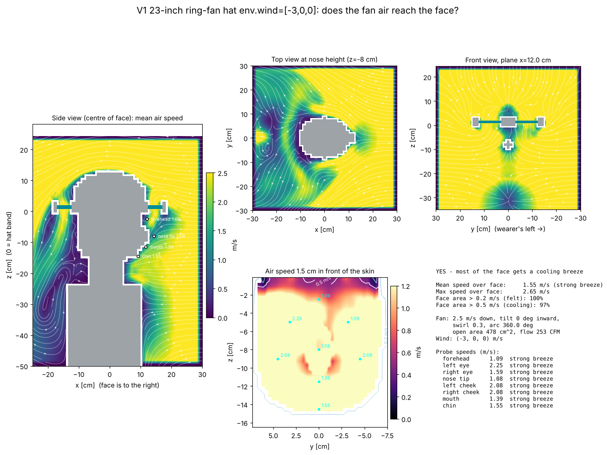

# V1 23-inch ring-fan hat env.wind=[-3,0,0]: airflow to the face

**YES - most of the face gets a cooling breeze**

| metric | value |
|---|---|
| mean air speed over face | 1.55 m/s (strong breeze) |
| max air speed over face | 2.65 m/s |
| face area feeling > 0.2 m/s | 100% |
| face area cooled > 0.5 m/s | 97% |
| fan exit speed / open area | 2.5 m/s / 478 cm² |
| fan volume flow | 120 L/s (253 CFM) |

## Probes

| point | mean speed m/s | turbulence rms m/s | feel |
|---|---|---|---|
| forehead | 1.09 | 0.00 | strong breeze |
| left eye | 2.25 | 0.00 | strong breeze |
| right eye | 1.59 | 0.01 | strong breeze |
| nose tip | 1.08 | 0.00 | strong breeze |
| left cheek | 2.08 | 0.00 | strong breeze |
| right cheek | 2.08 | 0.01 | strong breeze |
| mouth | 1.39 | 0.00 | strong breeze |
| chin | 1.55 | 0.01 | strong breeze |

## Solver

163,863 cells at 12 mm, 2500 steps (0.8 s simulated, averaged over the last 0.40 s), runtime 30 s.
