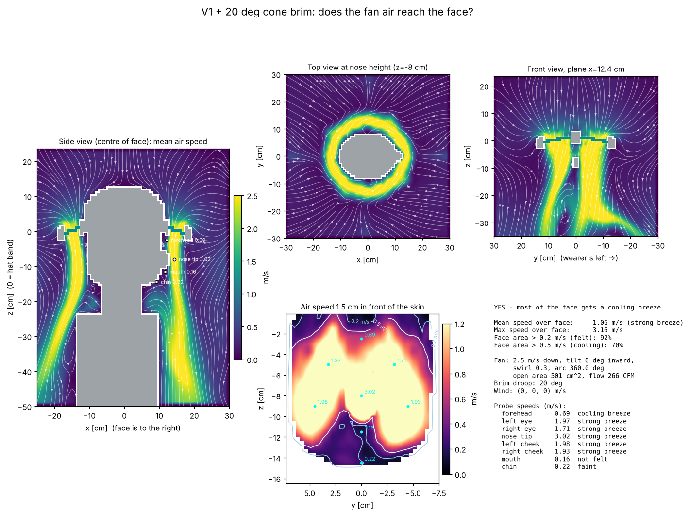

# V1 + 20 deg cone brim: airflow to the face

**YES - most of the face gets a cooling breeze**

| metric | value |
|---|---|
| mean air speed over face | 1.06 m/s (strong breeze) |
| max air speed over face | 3.16 m/s |
| face area feeling > 0.2 m/s | 92% |
| face area cooled > 0.5 m/s | 70% |
| fan exit speed / open area | 2.5 m/s / 501 cm² |
| fan volume flow | 125 L/s (266 CFM) |

## Probes

| point | mean speed m/s | turbulence rms m/s | feel |
|---|---|---|---|
| forehead | 0.69 | 0.01 | cooling breeze |
| left eye | 1.97 | 0.01 | strong breeze |
| right eye | 1.71 | 0.01 | strong breeze |
| nose tip | 3.02 | 0.02 | strong breeze |
| left cheek | 1.98 | 0.02 | strong breeze |
| right cheek | 1.93 | 0.01 | strong breeze |
| mouth | 0.16 | 0.02 | not felt |
| chin | 0.22 | 0.03 | faint |

## Solver

537,168 cells at 8 mm, 4894 steps (1.2 s simulated, averaged over the last 0.70 s), runtime 53 s.
