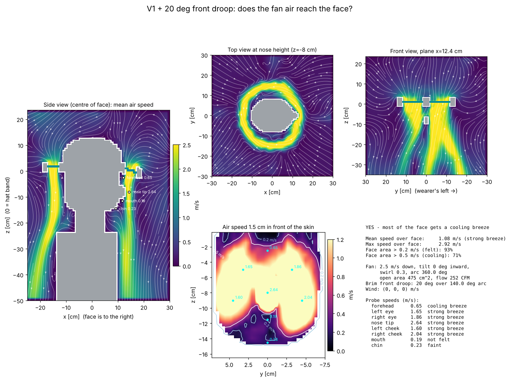

# V1 + 20 deg front droop: airflow to the face

**YES - most of the face gets a cooling breeze**

| metric | value |
|---|---|
| mean air speed over face | 1.08 m/s (strong breeze) |
| max air speed over face | 2.92 m/s |
| face area feeling > 0.2 m/s | 93% |
| face area cooled > 0.5 m/s | 71% |
| fan exit speed / open area | 2.5 m/s / 475 cm² |
| fan volume flow | 119 L/s (252 CFM) |

## Probes

| point | mean speed m/s | turbulence rms m/s | feel |
|---|---|---|---|
| forehead | 0.65 | 0.01 | cooling breeze |
| left eye | 1.65 | 0.01 | strong breeze |
| right eye | 1.86 | 0.01 | strong breeze |
| nose tip | 2.64 | 0.02 | strong breeze |
| left cheek | 1.60 | 0.03 | strong breeze |
| right cheek | 2.04 | 0.01 | strong breeze |
| mouth | 0.19 | 0.02 | not felt |
| chin | 0.23 | 0.05 | faint |

## Solver

537,168 cells at 8 mm, 4894 steps (1.2 s simulated, averaged over the last 0.70 s), runtime 176 s.
