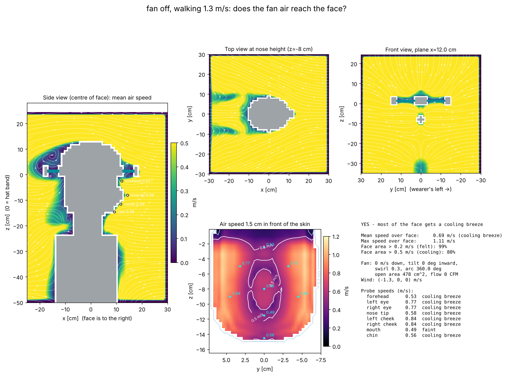

# fan off, walking 1.3 m/s: airflow to the face

**YES - most of the face gets a cooling breeze**

| metric | value |
|---|---|
| mean air speed over face | 0.69 m/s (cooling breeze) |
| max air speed over face | 1.11 m/s |
| face area feeling > 0.2 m/s | 99% |
| face area cooled > 0.5 m/s | 80% |
| fan exit speed / open area | 0 m/s / 478 cm² |
| fan volume flow | 0 L/s (0 CFM) |

## Probes

| point | mean speed m/s | turbulence rms m/s | feel |
|---|---|---|---|
| forehead | 0.53 | 0.01 | cooling breeze |
| left eye | 0.77 | 0.01 | cooling breeze |
| right eye | 0.77 | 0.01 | cooling breeze |
| nose tip | 0.58 | 0.01 | cooling breeze |
| left cheek | 0.84 | 0.01 | cooling breeze |
| right cheek | 0.84 | 0.01 | cooling breeze |
| mouth | 0.49 | 0.01 | faint |
| chin | 0.56 | 0.01 | cooling breeze |

## Solver

163,863 cells at 12 mm, 1084 steps (0.8 s simulated, averaged over the last 0.40 s), runtime 13 s.
